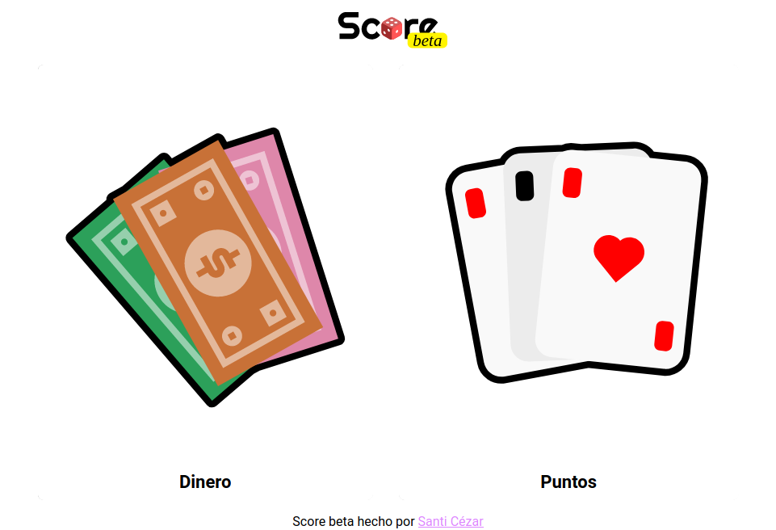

# 

(en beta)

Un contador de puntos web para tus juegos de mesa.

# Uso

Entre a [esta página](https://score.scez.ar) donde hosteo la aplicación. En el modo dinero cree un banco y agregue a los jugadores.

Para hacer una transacción haga click en el jugador/banco que entrega el dinero y luego el jugador/banco al que le va a entregar.

# TODO

- [x] Historial funcional
- [x] Modo para juegos de cartas
- [x] Acciones comunes
- [ ] Otros modos?